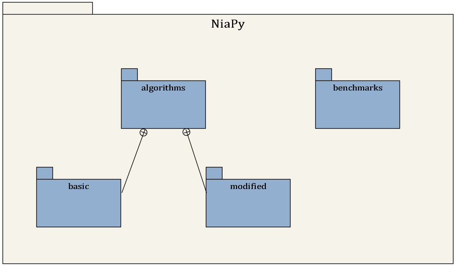

# Summary

Nature-inspired algorithms are a very popular tool for solving optimization problems[@Yang2014, @Hassanien2016]. Numerous variants of nature-inspired algorithms have been developed [@Fister2013] since the beginning of their era. To prove their versatility, those were tested in various domains on various applications, especially when they are hybridized, modified or adapted. However, implementation of nature-inspired algorithms is sometimes a difficult, complex and tedious task. In order to break this wall, `NiaPy` is intended for simple and quick use, without spending time for implementing algorithms from scratch.

Currently, the framework consists of algorithms, benchmark functions and supporting features. There are 8 basic implemented algorithms: Artificial Bee Colony algorithm, Bat algorithm, Differential Evolution algorithm, Firefly algorithm, Flower Pollination algorithm, Genetic algorithm, Grey Wolf Optimizer, Particle Swarm Optimization and 2 hybrid variants: Hybrid Bat algorithm, self-adaptive Differential Evolution algorithm. The following benchmark functions are also included in framework: Ackley, Alpine, Alpine1, Alpine2, Chung Reynolds, Csendes, Griewank, Happy cat, Pintér, Qing, Quintic, Rastrigin, Ridge, Rosenbrock, Salomon, Schumer Steiglitz, Schwefel, Schwefel 2.21, Schwefel 2.22, Sphere, Step, Step2, Step3, Stepint, Styblinski-Tang, Sum Squares, Whitley. A supporting feature consists of a runner utility that allows users to run selected algorithms easily, along with predefined or customized benchmark functions. By the same token, it also allows export to various formats, such as, for example, LaTeX, JSON, and Excel.

Key features of NiaPy:

- Since it is a very extensible framework, new algorithms can be integrated into it easily.
- Good documentation.
- Practitioner friendly. Users do not need to implement algorithms from scratch.
- Due to the many implemented algorithms, researchers can study how similar algorithms are (the problem of metaphor-based algorithms[@Sorensen2015]).
- The framework allows a fair comparison. Only a number of function evaluations are taken as the stopping criterion.
- Reviewers can check for referential results quickly.
- Rapid prototyping of new approaches, especially modified algorithms.
- Supportive community.

In conclusion, NiaPy is a new microframework for building and using nature-inspired algorithms in Python. Stepping stones for the design and implementation of NiaPy were the limitations of existing software, that were mostly limited in documentation, number of algorithms, inconsistent stopping criteria, non-modular software architecture. In the future, more algorithms will be added to the current collection, while support will also be developed for constraint optimization problems.

# References
